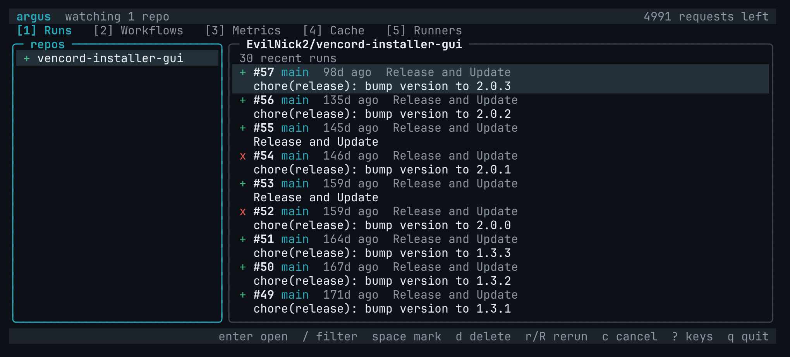

# gh-argus

A terminal UI for watching GitHub Actions across many repositories at once.



Argus polls with conditional requests, so a repo with nothing new costs no
rate limit, and it remembers the last runs it saw so a restart opens straight
onto them.

## Install

```sh
gh extension install EvilNick2/gh-argus
```

## Usage

```sh
gh argus
gh argus -R owner/repo -R owner/other
```

With no `-R`, argus opens a picker listing every repo you own, collaborate
on, or can see through an organisation you belong to, with the state of each
one's latest run. `space` selects, `/` filters, `o` cycles through owners and
`enter` starts watching. The picker remembers your last selection, and `p`
brings it back at any time.

`-R` skips the picker and watches the repos given.

### Tabs

1. **Runs.** Recent runs of each watched repo, live. Open a run to see its
   jobs and steps, then a job's log, with search and word wrap. Rerun,
   cancel, force cancel and delete runs, filter them with `/`, and step back
   through a run's earlier attempts with `a`. GitHub only publishes a job's
   log once the job finishes, so until then its log screen shows the steps
   live, then switches to the full log by itself.
2. **Workflows.** Every workflow and whether it is enabled. Run one on the
   default branch, or choose a branch and fill in its inputs first. Enable or
   disable it.
3. **Metrics.** Success rate, median duration, trend and reruns per repo and
   per workflow, from each repo's last 100 runs.
4. **Cache.** Actions caches with their sizes and each repo's total, and
   deleting them.
5. **Runners.** Self-hosted runners and whether they are busy. Listing them
   needs admin on the repo.

Press `?` for every key. The mouse works too: click to select, double-click
to open, scroll with the wheel and use the back button to go back. Hold
shift to select text for copying.

The terminal bell rings when a watched run finishes.

Anything that changes a repo asks y/n first. The one exception is submitting
the branch and inputs form, since submitting it is the confirmation.

### Token

Argus uses the token `gh` is logged in with. It needs the `repo` and
`read:org` scopes, which a default `gh auth login` already grants.

### Files

Argus keeps three files in `gh-argus` under your config directory, which is
`~/.config` on Linux, `~/Library/Application Support` on macOS and
`%AppData%` on Windows:

- `repos.json`, the repo list the picker opens on before it refreshes.
- `selection.json`, the repos last chosen in the picker.
- `snapshots.json`, the last runs seen for each repo, with the ETag that
  lets the first poll after a restart come back free.

Deleting them is safe. They are rebuilt as you go.

## Development

```sh
go build
gh extension install .
gh argus
```

`gh extension install .` links the local checkout, so each `go build` is
picked up immediately. Remove it with `gh extension remove argus`.

```sh
go test ./...
ARGUS_LIVE=1 go test -v -run Live ./...
```

The live tests call the real API with your token and change nothing.

Releases are built by `cli/gh-extension-precompile` when a `v*` tag is pushed.
Tags containing a hyphen, such as `v0.1.0-rc.1`, publish as prereleases.

## Licence

Apache-2.0, see [LICENSE](LICENSE).
